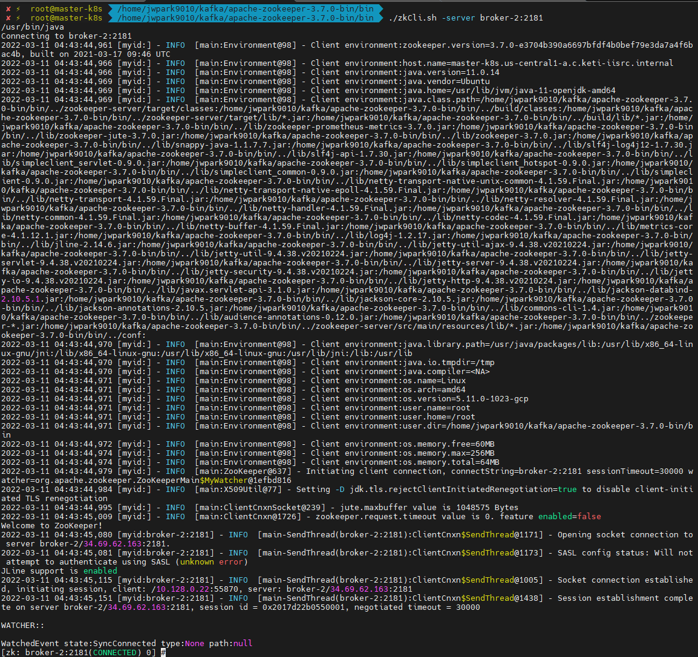
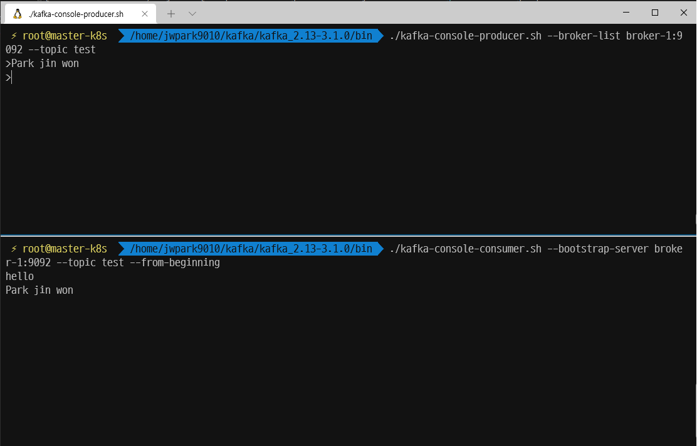

# Kafka 데이터 파이프 라인 
# Kafka 용어
- Broker : 카프카 애플리케이션 서버 단위
- Topic : 데이터 분리 단위, 다수 파티션 보유
- Partitaion : 레코드를 담고 있음, 컨슈머 요청시 레코드 전달
- Offset : 각 레코드당 파티션에 할당된 고유 번호
- Consumer : 레코드를 polling하는 애플리케이션
    - Consumer group : 다수 컨슈머 묶음
    - Consumer offset : 특정 컨슈머가 가져간 레코드 번호
- Producer : 레코드를 브로커로 전송하는 애플리케이션
- Replication : 파티션 복제 기능
    - ISR : 리더 + 팔로워 파티션의 sync가 된 묶음
- Rack-awareness : Server rack 이슈에 대응

# Kafka 설치
## Apach kafka 설치
### 1. Download
```bash
# zoopeeker 다운로드
wget "https://dlcdn.apache.org/zookeeper/zookeeper-3.8.0/apache-zookeeper-3.7.0-bin.tar.gz"
# kafka 파일 다운로드
wget "https://www.apache.org/dyn/closer.cgi?path=/kafka/3.1.0/kafka_2.13-3.1.0.tgz"

# 압축해제
tar xvfz kafka_2.13-3.1.0.tgz
tar -zxvf apache-zookeeper-3.7.0-bin.tar.gz
```
---------------------------------
### 2. Zookeeper 설정 및 실행
2-1. zookeeper 설정
- kafka를 실행하기 위해서는 Zookeeper가 실행되어야함
- ip 주소가 아닌 host name으로 통신하기 위한 설정
    ```bash
        vi /etc/hosts

        #내용 추가
        broker-1 (ip 주소)
        broker-2 (ip 주소)
        broker-3 (ip 주소)
    ```
        
        
- .cfg 파일 수정
    ```bash
    # 압축해제 후 폴더 진입
    vi conf/(cfg 파일)

    # 아래 내용 수정 및 추가
    dataDir=/tmp/zookeeper/data

    server.1=broker-1:2888:3888
    server.2=broker-2:2888:3888
    server.3=broker-3:2888:3888
    ```
- myid 파일 추가
    - 해당 파일은 위에서 cfg 파일 수정시 dataDir 경로에 만들어줘야함
        ```bash
        #broker-1 서버에서
        echo "1" > /tmp/zookeeper/data/myid
        #broker-2 서버에서 실행
        echo "2" > /tmp/zookeeper/data/myid
        #broker-3 서버에서
        echo "3" > /tmp/zookeeper/data/myid
        ```
- 방화벽 설정
    - zookeeper 는 2181, 2888, 3888 port를 사용하기 때문에 방화벽 설정이 필요
    - 이때, kafka 통신을 위해 9092 port도 같이 열어줄것 (귀찮으니 할때 한번에!!)

2-2. zookeeper 실행 및 확인
```bash
#zookeeper의 bin 폴더에서
./zkServer.sh start # 모든 서버에서 다 실행 해줘야함
./zkCli.sh -server (ip 주소:2181)
```


### 3. kafka 설정 및 실행
3-1. kafka 설정
- zookeeper와 마찬가지로 3개의 서버에 설치후 config파일을 수정하여함
    ```bash
    #broker-1 서버인 경우 아래와 같이 설정
    
    vi config/server.properties #kafka 압축 해제 폴더에 진입 후 

    # 아래 내용 수정 및 추가
    broker.id = (각 서버별로 다른 숫자) #서버1 -> broker.id=0 / 서버2 -> broker.id=1 / 서버3 -> broker.id=2

    listeners=PLAINTEXT://:9092
    advertised.listeners=PLAINTEXT://broker-1:9092
    
    #이전에 설정한 zookeeper의 host name과 port 설정
    zookeeper.connect = broker-1:2181,broker-2:2181,broker-3:2181
    ```
- server.properties 옵션

    |옵션 이름|설명|
    |--------|----|
    |broker.id|정수로 된 브로커 번호. 클러스터 내 고유번호로 지정|
    |listeners|kafka 통신에 사용되는 host:port|
    |advertised.listeners|kafka client가 접속할 host:port|
    |log.dirs|메시지를 저장할 디스크 디렉토리. 세그먼트가 저장됨|
    |log.segment.bytes|메시지가 저장되는 파일의 크기 단위|
    |log.retention.ms|메시지를 얼마나 보존할지 지정. 닫힌 세그먼트를 처리|
    |zookeeper.connect|브로커의 메타데이터를 저장하는 주키퍼의 위치|
    |auto.create.topics.enable|자동으로 토픽이 생성여부|
    |num.partitions|자동생성된 토픽의 default partition 개수|
    |message.max.bytes|kafka broker에 쓰려는 메시지 최대 크기|

3-2. kafka 실행 및 확인
- kafka 실행
    ```bash
    #kafka 폴더의 bin 경로에서
    ./kafka-server-start.sh ../config/server.properties
    ```
- kafka 작동 확인을 위한 topic 생성
    ```bash
    #kafka 폴더의 bin 경로에서
    ./kafka-topics --create --bootstrap-server broker-1:9092,broker-2:9092,broker-3:9092 --replication-factor 1 --partitions 1 --topic test_log
    ```
- console producer와 consumer로 데이터 확인
    ```bash
    #kafka 폴더의 bin 경로에서
    #터미널을 하나 띄운 후 아래 내용 실행
    ./kafka-console-producer.sh --broker-list broker-1:9092 --topic test 

    #또 다른 터미널을 하나 띄운 후 아래 내용 실행
    ./kafka-console-consumer --bootstrap-server borker-1:9092 --topic test --from-beginning
    ```
    
    - 위와 같이 서로 통신하는 것을 확인 할 수 있음

---------------------------------
# Kafka 모니터링 시스템
### 1. CMAK 다운로드, 설치, 설정 및 실행
- github.com/yahoo/CMAK/releases 에서 다운로드 
- 다운로드 파일 압축해제
    ```bash
    tar -xf CMAK-3.0.0.5.tar.gz
    ```
- 압축을 푼 후, 해당 폴더에서 sbt 파일을 이용하여 빌드 (시간이 좀 걸림)
    ```bash
    ./sbt clean dist
    ```
- 위의 과정이 완료되면, target/universal 디렉토리에 cmak-3.0.0.5.zip 파일이 생성되는데 이 파일이 배포용으로 실행가능한 파일들을 담고 있다. 따라서, 해당 파일을 원하는 위치에 옮긴 후 압축 해제
    ```bash
    unzip cmak-3.0.0.5.zip
    ```
- conf 파일 수정
    ```bash
    # ~/cmak-3.0.0.5/conf/application.conf
    
    # 다른것들 다 제외하고 

    cmak.zkhosts="{A 서버:port, B서버:port ....}"
    ```
- kafka 설정파일에 JMX_PORT 추가
    ```bash
    #~/kafka/config/server.properties
    export JMX_PORT=9999
- CMAK 실행
    ```bash
    bin/cmak -Dconfig.file=./conf/application.conf  -Dhttp.port=8080
    ```
### 2. AKHQ
<특징>
- CMA와 유사하게 UI를 통해서 모니터링 가능하며, Live data 확인, Scheme registry등 관리 가능
- 인증 및 메시지 조회/검색이 가능하며, Kafka 핵심 서비스와 연동을 지원
    - 다양한 기능 제공 : Message 검색, Live Tail, 인증(LDAP 등) 연동
    - 운영 기능 : Topic의 Message 전송, Topic 설정 관리, Group별 권한 관리 기능
    - Kafka 핵심 서비스 연동 : Scheme Registry 연동, Kafka Connect 연동
- Zookeeper를 바라보지않고 Broker를 직접 바라고보 모니터링함

<설치 절차>
- VM 방화벽 추가 (Port 허용 추가)
- Java11 & AKHQ설치
- AKHQ 설정 및 실행
- Browser에 접속하여 모니터링할 Kafka cluster 추가

<다운로드, 설정 및 실행>
- akhq 다운로드
    ```bash
    wget "https://github.com/tchiotludo/akhq/releases/download/0.20.0/akhq.jar"
    ```
- 설정 파일 생성
    - 다양한 설정이 있지만, 기본적인것을 사용하기 위해서 아래 내용으로만 config 파일 생성후 붙여넣기
    ```bash
    vi akhq_config.yml
    ```
    ```yml
    akhq:
      connections:
        local:
          properties:
            bootstrap.servers: "{broker server ip}"
    ```
- 실행
    ```bash
    java -Dmicronaut.config.files=akhq_config.yml -jar akhq.jar
    ```
---------------------------------
# kafka Connect
## Standalone vs Distributed
- Standalone : 하나의 작업 프로세스를 통해 모든 Connector와 Task가 실행, 테스트 시에는 유용
- Distributed : 대용량 데이터 처리를 위해서 추천
    - Distributed 기본 설정 (connect-distributed.properties 파일)

    |설정|설명|
    |------|----|
    |offset.storage.topic|offsets을 저장하기 위한 topic이다. topic은 반드시 다수의 파티션으로 이루어져야 하고, 복제가 되어야 한다.|
    |config.storage.topic|Connector와 task 설정을 저장한다. 반드시 이 topic은 단일 파티션이어야 하며, 높은 복제 계수를 가져야 한다.|
    |status.storage.topic|상태를 저장하는 topic이다. 다수의 파티션으로 구성될 수 있으며, 복제가 되어야 한다.|
    |group.id|클러스터에 대한 유일한 이름이어야 하며, 반드시 consumer group IDs와 겹치지 않는 게 보장되어야 한다.|

    - Connectors 설정
        - Standalone 모드에서는 properties 파일에서 관리되나, distributed 모드에서는 rest api로 관리되며, connector를 생성하기 위한 JSON payload에 포함된다.

    |설정|설명|
    |----|---|
    |name|Connector의 유일한 이름이다. 동일한 이름을 등록하려고 하면 실패|
    |connect.class|Connector의 Java class, connector.class 설정은 다양한 형식을 지원한다. ex) org.apache.plc4x.kafka.Plc4xSourceConnector|
    |tasks.max|Connector에 의해 생성되어야 하는 최대 tasks 갯수이다. connector는 설정된 레벨의 병렬성을 지원하지 못하는 경우에는 더 작은 수의 tasks를 생성할 수도 있다.|
    |key.converter|선택적인 값으로, worker에 의해 설정된 default key converter를 override한다.|
    |value.converter|선택적인 값으로, worker에 의해 설정된 default value converter를 override한다.|
    
    

## Source Connect와 Sink Connect
- Source Connect : 소스에서 데이터를 읽어 Connect 데이터 객체로 작업 프로세스에 제공
- Sink Connect : 작업 프로세스로부터 Connect 데이터 객체를 받아서 대상 시스템에 반영

---------------------------------
## kafka 명령어
```bash
# topic, replica, partition 생성
./kafka-topics.sh --create --bootstrap-server {ip}:9092 --replication-factor 1 --partitions 3 --topic test

# test topic에 console 형태로 데이터 입력
./kafka-console-producer.sh --bootstrap-server {ip}:9092 --topic test

# console 형태로 들어간 데이터를 확인
./kafka-console-consumer.sh --bootstrap-server {ip}:9092 --topic test --from-beginning

# testgroup을 지정하고, console consumer로 확인
./kafka-console-consumer.sh --bootstrap-server {ip}:9092 --topic test -group testgroup --from-beginning

# consumer group 목록 확인
./kafka-consumer-groups.sh --bootstrap-server {ip}:9092 --list

# consumer groups의 상태 확인 
./kafka-consumer-groups.sh --bootstrap-server {ip}:9092 --group testgroup --describe

# offset을 가장 낮은 값으로 리셋
./kafka-consumer-groups.sh --bootstrap-server {ip}:9092 --group testgroup --topic test --reset-offsets --to-earliest --execute

# 특정 파티션의 offset을 특정 offset 값으로 변경 
./kafka-consumer-groups.sh --bootstrap-server {ip}:9092 --group testgroup --topic test:1 --reset-offsets --to-offset 10 --execute
```
-------------------------------------


## 참고
 - https://blog.voidmainvoid.net/325
 - https://kafka.apache.org/downloads
 - https://always-kimkim.tistory.com/entry/introduce-akhq
 - https://log-laboratory.tistory.com/180
 - https://github.com/yahoo/CMAK#starting-the-service
 - https://program-error-review.tistory.com/52
 - https://sarc.io/index.php/miscellaneous/1436-kafka
 - https://iamhereweare.com/2021/01/13/kafka-connect/
 - https://kafka.apache.org/documentation/#connect_configuring
