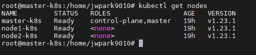
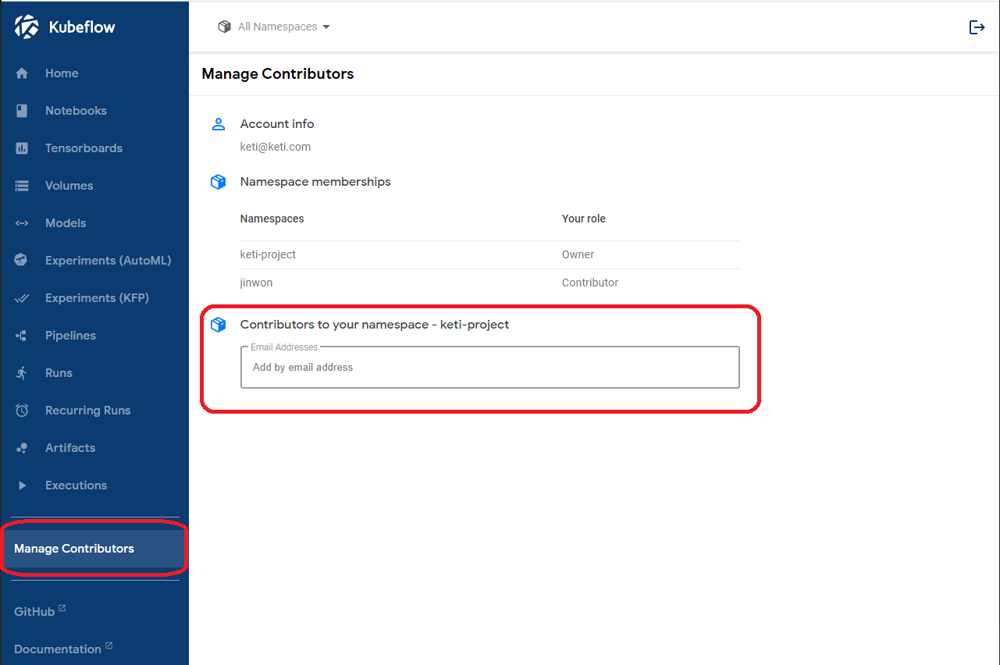

# (Local) k8s & Kubeflow 환경구성
## 설명
- 하나의 마스터 노드와 2개의 워커노드로 환경 구성
-------------------------------------------------------------------------
## 1. Docker 설치
``` bash
    sudo apt-get update

    sudo apt-get install -y ca-certificates curl gnupg lsb-release

    curl -fsSL https://download.docker.com/linux/ubuntu/gpg | sudo gpg --dearmor -o /usr/share/keyrings/docker-archive-keyring.gpg

    echo \ "deb [arch=$(dpkg --print-architecture) signed by=/usr/share/keyrings/docker-archive-keyring.gpg] https://download.docker.com/linux/ubuntu \ $(lsb_release -cs) stable" | sudo tee /etc/apt/sources.list.d/docker.list > /dev/null

    sudo apt-get update

    sudo apt-get install docker-ce docker-ce-cli containerd.io

    docker version 

    sudo mkdir /etc/docker

    cat <<EOF | sudo tee /etc/docker/daemon.json
    {
    "exec-opts": ["native.cgroupdriver=systemd"],
    "log-driver": "json-file",
    "log-opts": {
        "max-size": "100m"
    },
    "storage-driver": "overlay2"
    }
    EOF

    sudo mkdir -p /etc/systemd/system/docker.service.d

    sudo systemctl daemon-reload
    sudo systemctl restart docker
```


## 2. k8s 설치
### 2-1. 설치 전 환경설정
- Master node와 Worker node에 모두 환경설정을 해줘야함
- sudo를 매번 사용하기 번거롭기 때문에 sudo su로 root 권한을 줌

```bash
    swapoff -a && sed -i '/swap/s/^/#/' /etc/fstab

    cat <<EOF | sudo tee /etc/sysctl.d/k8s.conf
    net.bridge.bridge-nf-call-ip6tables = 1
    net.bridge.bridge-nf-call-iptables = 1
    EOF

    sudo sysctl –system

    systemctl stop firewalld

    systemctl disable firewalld
```


### 2-2. kudeadm, kubectl, kubelet 설치
```bash
    apt-get update

    apt-get install -y apt-transport-https ca-certificates curl

    curl -fsSLo /usr/share/keyrings/kubernetes-archive-keyring.gpg https://packages.cloud.google.com/apt/doc/apt-key.gpg

    echo "deb [signed-by=/usr/share/keyrings/kubernetes-archive-keyring.gpg] https://apt.kubernetes.io/ kubernetes-xenial main" | sudo tee /etc/apt/sources.list.d/kubernetes.list

    apt-get update

    sudo apt-get install -qy kubelet=1.19.0-00 kubectl=1.19.0-00 kubeadm=1.19.0-00

    apt-mark hold kubelet kubeadm kubectl

    systemctl start kubelet

    systemctl enable kubelet
```


### 2-3. Control-plane 구성(master node)
- Master node에서만 진행
```bash
    kubeadm init

    cat > token.txt #kubeadm init으로 나온 결과를 복사해서 넣기
    
```
- 여기서, kubectl get nodes 하면 실행이 안됨 아래 명령어들을 입력
```bash
    mkdir -p $HOME/.kube
    
    sudo cp -i /etc/kubernetes/admin.conf $HOME/.kube/config

    sudo chown $(id -u):$(id -g) $HOME/.kube/config
```
- 위 명령어를 실행시키고 kubectl get nodes를 실행시키면, 정상적으로 출력이 됨
- (위의 명령어를 치고 나서 출력창을 보게되면) STATUS가 NotReady인데 이것은 Container Network Interface(CNI)때문임
  - 다양한 종류의 CNI가 있으나 해당 프로젝트에서는 WeaveNet 설치
```bash
    kubectl apply -f https://cloud.weave.works/k8s/net?k8s-version=$(kubectl version | base64 | tr -d '\n’)
```
- kubectl get nodes 하게되면 상태가 Ready로 바뀜 
- 아래 에러 발생시, https://blog.flgram.com/m/835 참고
```
#에러 내용
[kubelet-check] The HTTP call equal to 'curl -sSL http://localhost:10248/healthz' failed with error: Get "http://localhost:10248/healthz": dial tcp 127.0.0.1:10248: connect: connection refused.
```

### 2-4. Worker node 구성
- token.txt 파일의 내용을 복사해서 Worker node에 붙여넣기
- (Master node에서) kubectl get nodes 하게 되면 아래 그림과 같이 node들이 들어옴
- 


## 3. Kubeflow 설치
### 3-1. 사전설정 ([5] 참조)
1. dynamic volume provisioner 설치
- kubeflow를 쉽게 설치하기 위해서는 동적 볼륨 프로비져너(dynamic volume provisioner)가 필요 
- kubeflow는 기본 스토리지 클래스를 사용하기 때문에, local-path 스토리지 클래스를 기본 클래스로 설정해야함
```bash
    kubectl apply -f https://raw.githubusercontent.com/rancher/local-path-provisioner/master/deploy/local-path-storage.yaml

    kubectl get storageclass #조회

    kubectl patch storageclass local-path -p '{"metadata": {"annotations":{"storageclass.kubernetes.io/is-default-class":"true"}}}'

    kubectl get sc #기본 클래스가 설정된 것을 확인
``` 


### 3-2. kubeflow 1.4 파일 다운로드 및 사전 환경설정 ([4] 참조) 
- kubeflow 1.3v 이후로 kustomize를 이용하여 간단하게 kubeflow 설치할 수 있음
```bash
    git clone https://github.com/kubeflow/manifests.git
    git checkout v1.4-branch #1.4v 설치하기 위한 브랜치 변경
```
- 설치전에 kubeflow에 접속 계정 수정
```bash
# 1. manifests/common/user-namespace/base/params.env 파일수정
# before
    user=user@example.com
    profile-name=kubeflow-user-example-com
# after
    user= (User 이메일)
    profile-name= (구분 이름)
```
```bash
#2. manifests/common/dex/base/config-map.yaml 파일수정
# before
    staticPasswords:
    - email: user@example.com
      hash: $2y$12$4K/VkmDd1q1Orb3xAt82zu8gk7Ad6ReFR4LCP9UeYE90NLiN9Df72
      # https://github.com/dexidp/dex/pull/1601/commits
      # FIXME: Use hashFromEnv instead
      username: user
      userID: "15841185641784"

# after
    staticPasswords:
    - email: (User 이메일)
      hash: (비밀번호에 대한 해쉬 변환값)
      username: (User 이름)
      userID: (User ID)
```


### 3-3. kustomize 다운로드
- kubeflow 1.4를 설치하기 위해서는 kustomize가 필요 [7]
- kustomize 파일은 이전에 설치된 manifests에 다운
```bash
    wget https://github.com/kubernetes-sigs/kustomize/releases/download/v3.2.0/kustomize_3.2.0_linux_amd64

    mv kustomize_3.2.0_linux_amd64 kustomize
```


### 3-4. kustomize 이용하여 kubeflow 설치
- manifests 폴더로 이동한뒤 아래의 명령어를 수행
```bash
    while ! kustomize build example | kubectl apply -f -; do echo "Retrying to apply resources"; sleep 10; done
```

### 3-5. 서비스 활용을 위한 포트포워딩 작업
- 아래 명령어를 사용하여 나오는 PORT들에 대해서 포트포워딩 작업을 해줘야함
```bash
    kubectl get svc -n istio-system  istio-ingressgateway 
```

## 4. 다중 사용자 관리
### 4-1. 사용자 추가
- 현재 구성된 시스템에서는 dex-config.yaml에 사용자를 추가
```yaml
# 아래 yaml은 사용자를 추가한 것이다.
issuer: http://dex.auth.svc.cluster.local:5556/dex
storage:
  type: kubernetes
  config:
    inCluster: true
web:
  http: 0.0.0.0:5556
logger:
  level: "debug"
  format: text
oauth2:
  skipApprovalScreen: true
enablePasswordDB: true
staticPasswords:
- email: (추가할 사용자 계정) 
  hash: (사용자 계정에 대한 비밀번호)
  # https://github.com/dexidp/dex/pull/1601/commits
  # FIXME: Use hashFromEnv instead
  username: (사용자 이름)
  userID: (사용자 아이디)
staticClients:
# https://github.com/dexidp/dex/pull/1664
- idEnv: OIDC_CLIENT_ID
  redirectURIs: ["/login/oidc"]
  name: 'Dex Login Application'
  secretEnv: OIDC_CLIENT_SECRET
```
### 4-2. Kubeflow Project 초대
- 사용자에게 kubeflow project 참여하는 방법
    - project 관리자가 contributor의 계정을 등록
        - 여기서, 계정은 위에 사용자를 추가 했을때의 email 계정을 말함
        - 관리자가 추가를 해주게 되면 사용자는 kubeflow 상단의 namespace 선택 부분에 해당 project에 초대됨을 확인할 수 있음
    - 

### 4-3. 사용자에게 새로운 Project 관리자 주는 방법
- 사용자에게 프로잭트의 Owner 즉, 관리자를 주는 방법은 아래와 같다
    ```yaml
    apiVersion: kubeflow.org/v1beta1
    kind: Profile
    metadata:
    name: jinwon   # replace with the name of profile you want, this will be user's namespace name
    spec:
    owner:
        kind: User
        name: jwpark9010@gmail.com   # replace with the email of the user
    ---
    apiVersion: kubeflow.org/v1beta1
    kind: Profile
    metadata:
    name: keti-project   # replace with the name of profile you want, this will be user's namespace name
    spec:
    owner:
        kind: User
        name: keti@keti.com   # replace with the email of the user
    ```
    ```bash
    kubectl apply -f <Profile 이름> # 실행시 적용됨
    ```
- 위의 과정을 진행하고 등록한 계정으로 kubeflow에 로그인 하게되면, 지정한 metadata의 이름으로 namespace가 생김을 볼 수 있으며, 해당 계정이 Owner가 되어있을을 확일 할 수 있다. 
- Owner로 된 계정은 다른 kubeflow 사용자를 해당 프로젝트에 참여할 수 있게 된다. 
-------------------------------------------------------------
## 주요 참고 자료
- [1] (K8s & kubeflow설치) https://mlops-for-all.github.io/en/docs/setup-components/install-components-kf/
- [2] (k8s 설치) https://www.youtube.com/channel/UC_VOQjI7mtQTEaTXXQIzLtQ
- [3] (k8s 설치) https://github.com/237summit/k8s_core_labs
- [4] (kubeflow 설치) https://suwani.tistory.com/m/18
- [5] (kubeflow 설치) https://www.kangwoo.kr/2020/02/18/pc%EC%97%90-kubeflow-%EC%84%A4%EC%B9%98%ED%95%98%EA%B8%B0-3%EB%B6%80-kubeflow-%EC%84%A4%EC%B9%98%ED%95%98%EA%B8%B0/
- [6] (kubeflow 설치) https://mkbahk.medium.com/ubuntu-18-04%EC%83%81%EC%97%90-kubeflow-%EC%84%A4%EC%B9%98%ED%95%98%EA%B8%B0-496a36c906f9
- [7] (kustomize 설치) https://github.com/kubernetes-sigs/kustomize/releases/tag/v3.2.0
- [8] (예제실험)https://www.kubeflow.org/docs/components/katib/overview/
- [9] (kubeflow 계정비번 hash) https://passwordhashing.com/BCrypt
- [10] (에러해결) https://blog.flgram.com/m/835
- [11] (에러해결) https://velog.io/@moey920/%EC%97%90%EB%9F%AC-%ED%95%B4%EA%B2%B0-Katib-Pods-Running-%EC%83%81%ED%83%9C%EB%A1%9C-%EB%AF%B8%EC%A7%84%ED%96%89-%EC%98%A4%EB%A5%98
- [12] (에러해결) https://yjwang.tistory.com/68
- [13] (에러해결) https://github.com/kubeflow/manifests/issues/959
  - vi /etc/kubernetes/manifests/kube-apiserver.yaml 아래 내용 추가
    - --service-account-signing-key-file=/etc/kubernetes/pki/sa.key
    - --service-account-issuer=kubernetes.default.svc
