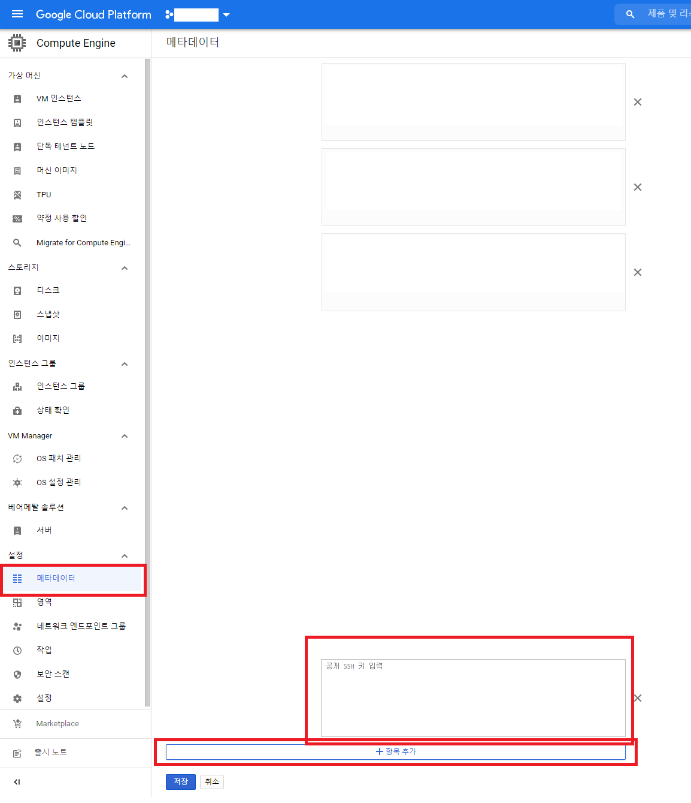
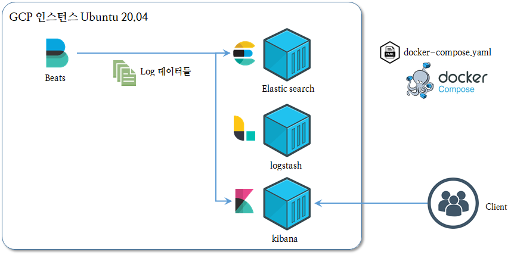
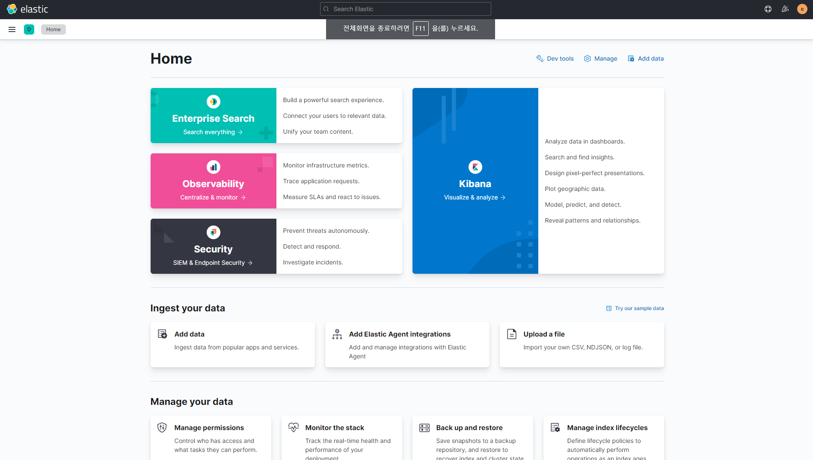
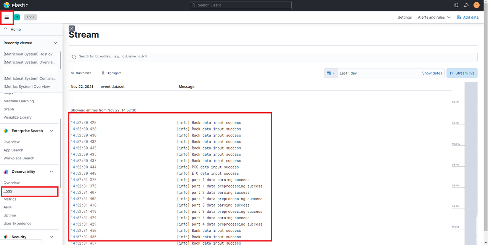
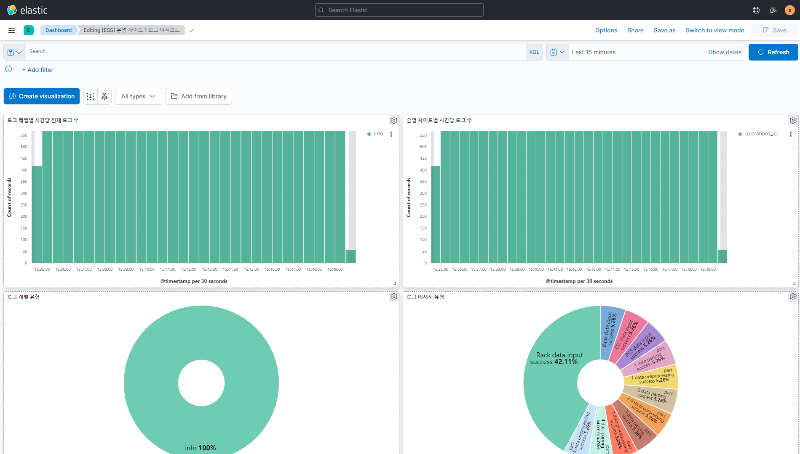

# Data ingestion (데이터 수집 시스템)

> 한국전자기술연구원 윤태일 연구원 / taeil777@keti.re.kr


## 개요
  대규모 분산에너지 저장장치 인프라의 안전한 자율운영 및 성능 평가를 위한 지능형 안전SW 프레임워크를 개발하기 위해 퍼블릭 클라우드 기반 에너지 데이터 수집‧저장 시스템의 일부로 태양광 ESS에서 측정되는 데이터를 수집하고 이를 규격화하여 퍼블릭 클라우드에 축적한다.


</br>

-----


## (0) 개발 환경구축
  - ### GCP 인스턴스 생성 및 ssh접속
    - 개발 환경을 위한 인스턴스는 GCP(Google Cloud Platform) 기준 다음과 같은 스펙으로 생성
      - e2-standard-8
      - cpu 4개, ram 32GB
      - OS : Ubuntu 20.04 LTS
      - SSD : 200GB, HDD 4TB

    - ssh 접속을 위한 접속 도구
      - mobaXterm ([download](https://mobaxterm.mobatek.net/download.html))

    - GCP 인스턴스 ssh 접속을 위해 ssh 키를 생성
      ```
      $ ssh-keygen -t rsa -f <키이름> -C <계정>@<인스턴스IP>
      ```
      생성된 키에서 .pub (공개키) 부분을 복사하여 GCP에 등록한다.
      ```
      $ cat 공개키.pub

      ssh-rsa AAAAB3NzaC1yc2EAAAADAQABAAABAQC691G5q3zY8a0vYzu86EAcmyYPQxqto/EjzNQQGxbqZ5prbLo8iyZLmQ9LeR5BKRBS3tbLI4Kz6BuXgm8GGh/V2r2hq638g/SrgJjICpHA8szQwaZzzzyqeuF6Fhr5B/65/nuNj9mrluQMl+TrUkDTxVMK4iWfASN6NQcZ6yHnySZNIsBHSNk+LtF28arfnzkJgJL1M0ChltsT0u+L0X+7xKPPVNGjeH8Ymbdk1vLtDATmHhjXqUqnxz9zGwW0vg9LCONJ <계정>@<인스턴스IP>
      ```

      


      생성된 개인키를 통해 인스턴스 접속

      ```
      $ ssh -i <키이름> <계정>@<인스턴스IP>
      ```

      또는 mobaXterm을 통해 접속 


  </br>


  - ### Docker를 통한 TimescaleDB 구축
    - Docker 설치
      ```
      $ sudo apt update
      $ sudo apt-get install docker-ce docker-ce-cli containerd.io
      ```

    - TimescaleDB 선정 이유 ([timescaleDB Document](https://docs.timescale.com/))
      - 시계열 RDBMS 구조로 간편한 쿼리 및 빠른속도 지원
      - 하이퍼테이블을 통한 분산형 데이터베이스 구조 설계 가능
      - 카디널리티(전체 행에 대한 특정 컬럼의 중복수치를 나타내는 지표)에 따른 이점
      

    - TimescaleDB 설치
      
      이미지 pull 후 컨테이너 실행

      ```
      $ docker pull timescale/timescaledb-postgis:latest-pg12
      $ docker run -d --shm-size=8G --name timescaledb -p 5432:5432 -e POSTGRES_PASSWORD=<비밀번호> -v timescale_volume:/var/lib/postgresql/data timescale/timescaledb-postgis:latest-pg12
      ```
      
      인스턴스 디스크 마운트 및 Docker 볼륨 위치 변경
      ```
      # 디스크 정보 확인 후 포맷하고 마운트하려는 디스크 찾기
      $ sudo lsblk

      # mkfs로 디스크 포맷
      $ sudo mkfs.ext4 -m 0 -E lazy_itable_init=0,lazy_journal_init=0,discard /dev/<디스크이름>

      # 디스크 마운트
      $ sudo mkdir –p /mnt/disks/<마운트지점디렉토리이름>

      $ sudo mount -o discard,defaults /dev/<디스크이름> /mnt/disks/<마운트지점디렉토리이름>

      $ sudo chmod a+w /mnt/disks/<마운트지점디렉토리이름>
      

      # Docker 서비스 중지
      $ service docker stop

      # 이동할 디렉토리 생성
      $ mkdir –p /data/docker

      # 도커 옵션 변경
      # /etc/docker/daemon.json
      ...
      "data-root": "/data/docker",
      ...

      # 다음 명령어로 루트 디렉토리 변경 확인
      $ docker info | grep "Docker Root Dir"
      ```
  
  </br>


  - ### log 수집용 Elastic Stack 구축
    

    - ELK stack github gitclone 
      ```
      $ git clone https://github.com/ksundong/docker-elk-kor.git
      $ cd docker-elk
      ```

    - 환경에 맞게 편집기를 통해 yml 파일 수정

      ```
      $ vi /docker-elk/elasticsearch/config/elasticsearch.yml

      ## Default Elasticsearch configuration from Elasticsearch base image.
      ## https://github.com/elastic/elasticsearch/blob/master/distribution/docker/src/docker/config/elasticsearch.yml
      #
      cluster.name: "docker-cluster"
      network.host: 0.0.0.0

      ## X-Pack settings
      ## see https://www.elastic.co/guide/en/elasticsearch/reference/current/setup-xpack.html
      #
      discovery.type: single-node

      xpack.license.self_generated.type: trial
      xpack.security.enabled: true
      xpack.monitoring.collection.enabled: true
      ```

      ```
      $ vi docker-elk/kibana/config/kibana.yml

      ## Default Kibana configuration from Kibana base image.
      ## https://github.com/elastic/kibana/blob/master/src/dev/build/tasks/os_packages/docker_generator/templates/kibana_yml.template.ts
      #
      server.name: kibana
      #server.host: "0"
      server.host: 0.0.0.0
      elasticsearch.hosts: [ "http://elasticsearch:9200" ]
      #monitoring.ui.container.elasticsearch.enabled: true
      xpack.monitoring.ui.container.elasticsearch.enabled: true


      ## X-Pack security credentials
      #
      elasticsearch.username: elastic
      elasticsearch.password: 비밀번호쓰기
      ```

      ```
      $ vi docker-elk/logstash/config/logstash.yml

      ## Default Logstash configuration from Logstash base image.
      ## https://github.com/elastic/logstash/blob/master/docker/data/logstash/config/logstash-full.yml
      #
      http.host: "0.0.0.0"
      xpack.monitoring.elasticsearch.hosts: [ "http://elasticsearch:9200" ]

      ## X-Pack security credentials
      #

      xpack.monitoring.enabled: true
      xpack.monitoring.elasticsearch.username: elastic
      xpack.monitoring.elasticsearch.password: 비밀번호쓰기
      ```

      ```
      input {
        tcp {
                port => 5000
        }
      }

      ## Add your filters / logstash plugins configuration here

      output {
              elasticsearch {
                      hosts => "elasticsearch:9200"
                      user => "elastic"
                      password => "비밀번호쓰기"
              }
      }

      ```

    - Docker-compose.yml 파일 수정
      ```
      version: '3.2'

      services:
        elasticsearch:
          build:
            context: elasticsearch/
            args:
              ELK_VERSION: $ELK_VERSION
          volumes:
            - type: bind
              source: ./elasticsearch/config/elasticsearch.yml
              target: /usr/share/elasticsearch/config/elasticsearch.yml
              read_only: true
            - type: volume
              source: elasticsearch
              target: /usr/share/elasticsearch/data
          ports:
            - "9200:9200"
            - "9300:9300"
          environment:
            ES_JAVA_OPTS: "-Xmx256m -Xms256m"
            ELASTIC_PASSWORD: <비밀번호>
            # Use single node discovery in order to disable production mode and avoid bootstrap checks
            # see https://www.elastic.co/guide/en/elasticsearch/reference/current/bootstrap-checks.html
            discovery.type: single-node
          networks:
            - elk

        logstash:
          build:
            context: logstash/
            args:
              ELK_VERSION: $ELK_VERSION
          volumes:
            - type: bind
              source: ./logstash/config/logstash.yml
              target: /usr/share/logstash/config/logstash.yml
              read_only: true
            - type: bind
              source: ./logstash/pipeline
              target: /usr/share/logstash/pipeline
              read_only: true
          ports:
            - "5044:5044"
            - "5000:5000/tcp"
            - "5000:5000/udp"
            - "9600:9600"
          environment:
            LS_JAVA_OPTS: "-Xmx256m -Xms256m"
          networks:
            - elk
          depends_on:
            - elasticsearch

        kibana:
          build:
            context: kibana/
            args:
              ELK_VERSION: $ELK_VERSION
          volumes:
            - type: bind
              source: ./kibana/config/kibana.yml
              target: /usr/share/kibana/config/kibana.yml
              read_only: true
          ports:
            - "5601:5601"
          networks:
            - elk
          depends_on:
            - elasticsearch

      networks:
        elk:
          driver: bridge

      volumes:
        elasticsearch:

      ```
      ELASTIC_PASSWORD 수정, ES_JAVA_OPTS 수정 (메모리 지정)

    - Docker-compose.yml 실행
      ```
      $ sudo docker-compose up -d
      ```

    - IP:5601 을 통해 kibana 접속 확인
      


    - filebeat 설치
      ```
      $ curl -L -O https://artifacts.elastic.co/downloads/beats/filebeat/filebeat-7.2.0-amd64.deb
      $ sudo dpkg -i filebeat-7.2.0-amd64.deb
      ``` 

    - 수집할 로그 경로 지정 및 elasticsearch 연결 filebeat config 파일 수정
      ```
      $ vi /etc/filebeat/filebeat.yml

      #=========================== Filebeat inputs =============================

      filebeat.inputs:

      # Each - is an input. Most options can be set at the input level, so
      # you can use different inputs for various configurations.
      # Below are the input specific configurations.

      - type: log

        # Change to true to enable this input configuration.
        enabled: true

        # Paths that should be crawled and fetched. Glob based paths.
        paths:
          - /home/user/test/log/*.json

        json.keys_under_root: true
        json.overwrite_keys: true
        json.add_error_key: true
        json.expand_keys: true
      ```

      ```

      #-------------------------- Elasticsearch output ------------------------------
      output.elasticsearch:
        # Array of hosts to connect to.
        hosts: ["localhost:9200"]
        # Optional protocol and basic auth credentials.
        #protocol: "https"
        username: "elastic"
        password: "비밀번호"
        
        
        
        
      #============================== Kibana =====================================

      # Starting with Beats version 6.0.0, the dashboards are loaded via the Kibana API.
      # This requires a Kibana endpoint configuration.
      setup.kibana:

        # Kibana Host
        # Scheme and port can be left out and will be set to the default (http and 5601)
        # In case you specify and additional path, the scheme is required: http://localhost:5601/path
        # IPv6 addresses should always be defined as: https://[2001:db8::1]:5601
        host: "localhost:5601"
      ```
    - filebeat setup 및 실행
      ```
      $ filebeat setup -e
      $ service filebeat start
      ```

      

      


  
-----


## (1) 데이터 수집  


  - ### Modbus TCP 프로토콜 기반 수집 데이터 명세서에 따른 파싱 모듈 개발 

    - ModbusClient 라이브러리 pyModbusTCP 모듈의 경우 inputregister는 한 번에 최대 125개의 값만 가져올 수 있기 때문에 수집 데이터 명세서 기준에 따라 파싱 모듈을 설계 및 개발함

    </br>


  - ### 공통 데이터 규격 문서 기반 전처리 모듈 구조 설계 및 모듈 개발 
    
    - Modbus TCP 프로토콜의 경우 비트단위로 데이터를 전달하기 때문에 수신하는 쪽에서 음수변환 및 Scale factor에 의한 후처리가 필수적임
    
    - 수집되는 데이터의 이상치 판별을 위해 데이터 범위를 확인함 

    - 위 기능과 공통 데이터 규격 문서를 참고하여 수집되는 데이터의 활용을 위한 DB스키마 구조에 맞게 저장될 수 있도록 전처리 모듈 구조 설계 및 개발

    (공통데이터규격 문서 업로드 예정)

    </br>

  - ### 퍼블릭 클라우드(Google Cloud Platform) 상 TimescaleDB 기반으로 전처리된 수집 데이터 저장

    - GCP 인스턴스에 구축되어있는 TimescaleDB에 hypertable을 생성하고 데이터를 input할 수 있는 모듈을 작성(timescale_input_data.py)

    - 작성된 모듈을 사용하여 전처리된 데이터를 실시간 수집 

   
  - ### 코드 사용법
    1. modbus_client_oper1.py 에 접속할 IP와 포트번호를 입력
    2. timescale_input_data.py 에 저장할 timescaleDB 의 IP와 포트번호 입력
    3. 코드 실행

    </br>

    - ```
        $ python3 modbus_client_oper1.py
        ```

  - ### 수집 결과
    
   (저장된 BANK 데이터)

  </br>

-----

## (2) 데이터 축적


  - ### TimescaleDB를 통해 저장 데이터의 CSV 파일 변환 및 GCS(Google Cloud Storage) 버킷에 연-월-일 날짜별 데이터 축적
    - GCS에 접근할 수 있는 키 발급 (Json)
    - GCS 접근 및 객체 생성, 저장 기능의 GCS 모듈 개발
    - TimescaleDB에 접근 후 하루치 데이터를 연-월-일-테이블명 양식의 .csv파일로 export
    - 작성된 모듈을 통해 생성된 .csv파일을 연-월-일 날짜별로 GCS 버킷에 업로드
    - Linux 서버 상의 crontab을 통해 매일 자정에 코드 실행

    </br>

     - ```
        # 매일 자정에 실행되는 crontab 
        0 0 * * * python3 /gcs_data_accumulate.py
        ```

    -   
    (GCS 버킷에 날짜별로 저장된 csv파일)
  
    </br>


  - ### 코드 사용법
    1. gcp_storage.py 에 GCP프로젝트명, 버킷명, JSON 키 경로 입력
    2. timescale_input_data.py 에서 데이터를 불러올 timescaleDB 의 IP와 포트번호 입력
    3. 코드 실행

    </br>

    - ```
        $ python3 gcs_data_accumulate.py
        ```
    


